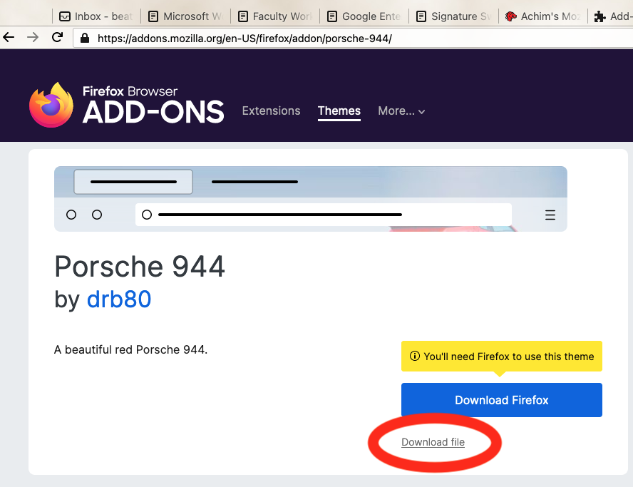
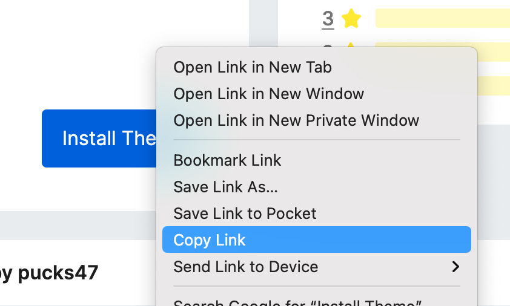
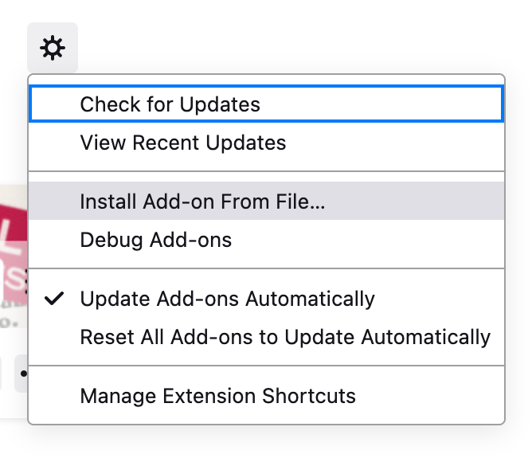

# Thematic

Easily switch between themes in Firefox and Thunderbird. This extension allows you to switch between installed themes via keyboard shortcuts or automatically rotate through themes at a customizable interval. You can also enable random theme selection for unpredictable variety.

**Note:** Autoswitching and tools menu integration are not supported in Thunderbird.

## Installation

- **Firefox**: [Install from Mozilla Add-ons](https://addons.mozilla.org/en-US/firefox/addon/personaswitcher/)
- **Thunderbird**: [Install from Thunderbird Add-ons](https://addons.thunderbird.net/en-US/thunderbird/addon/thematic/)

## Keyboard Shortcuts

- **Alt+Shift+D** - Switch to default theme
- **Alt+Shift+R** - Rotate to next theme
- **Alt+Shift+A** - Toggle autoswitching

These shortcuts can be customized in Firefox's extension settings (about:addons).

## Features & Configuration

Click the extension icon or open the **Options** page to configure:

- **Autoswitching** - Automatically rotate themes at a set interval
- **Interval** - How many minutes between theme changes (default: 30)
- **Random Mode** - Select themes randomly instead of cycling through in order

When autoswitching is enabled, themes rotate based on your interval setting. When disabled, use keyboard shortcuts to manually switch themes.

## Using Firefox Themes in Thunderbird

Thunderbird doesn't have its own theme system, but you can install Firefox themes in Thunderbird using one of these methods:

### Method 1: BrowseInTab Add-on (Recommended)

1. Install [BrowseInTab](https://addons.thunderbird.net/en-us/thunderbird/addon/browseintab/) in Thunderbird
2. Open a Firefox theme URL in Thunderbird's browser tab
3. Click "Download file" (ignore the "Download Firefox" prompt)
4. Thunderbird automatically recognizes and installs it as a theme

### Method 2: Manual Download

1. Find the Firefox theme you want
2. Right-click "Install Theme" and copy the link
3. Use curl, wget, or another browser to download the `.xpi` file locally
4. In Thunderbird, go to **Tools → Extensions and Themes**
5. Click the settings icon and select **Install Add-on From File...**
6. Select the downloaded `.xpi` file

**Note:** Thunderbird may require a restart to recognize newly installed themes.

