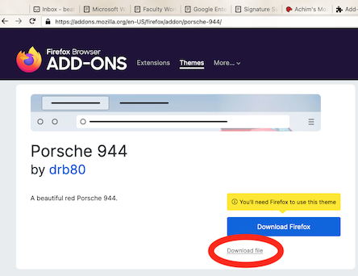
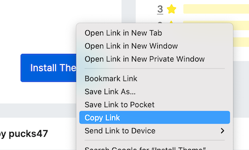
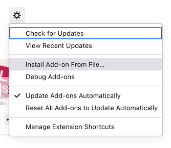

# Thematic

Easily switch between themes in Firefox and Thunderbird. This extension
allows you to switch between themes via keyboard combinations or every N
minutes. It also allows one to specify switching to a random next theme.
Autoswitching and having Thematic on the tools menu is not supported in
Thunderbird.

* https://addons.mozilla.org/en-US/firefox/addon/personaswitcher/
* https://addons.thunderbird.net/en-US/thunderbird/addon/thematic/

This is a re-implementation of personaswitcher that was developed for Firefox 4.

For Thunderbird, there are at least two way to use Firefox's themes.

## First way
Install https://addons.thunderbird.net/en-us/thunderbird/addon/browseintab/ in
Thunderbird and then surf to the Firefix theme URL you like. It will say
"Download Firefox" but you don't need to do that. Instead, click on
"Download file". Thunderbird will automagically recognize the file as a
theme and install it for you.

Really, it would be nice the Thunderbird to know to look for Firefox themes
automatically. Maybe I'll get around to that some day.

## Second way
Another approach is to find the FireFox theme you want and right-click
on the Install Theme. Choose Copy Link and use another program to download
the file locally. Curl, wget, or even another browser will do the trick.

In Thunderbird, go to Tools -> Extensions and Themes. Click the settings
icon and choose Install Add-on From File...

Click on the .xpi you downloaded and you should be good to go. It appears
that Thunderbird currently doesn't notify Thematic of the new theme, so a
restart is in order.
